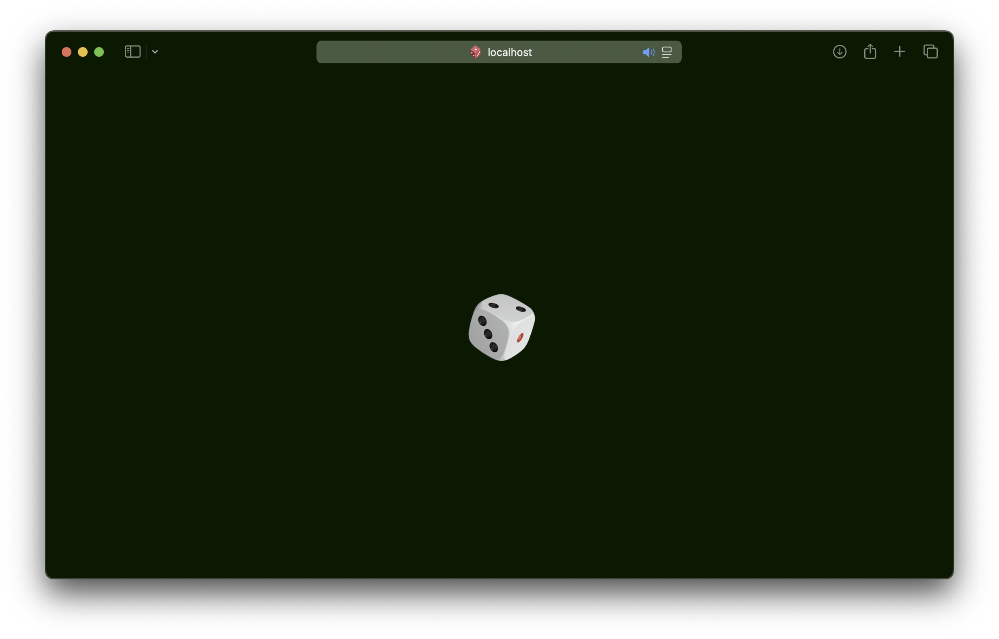
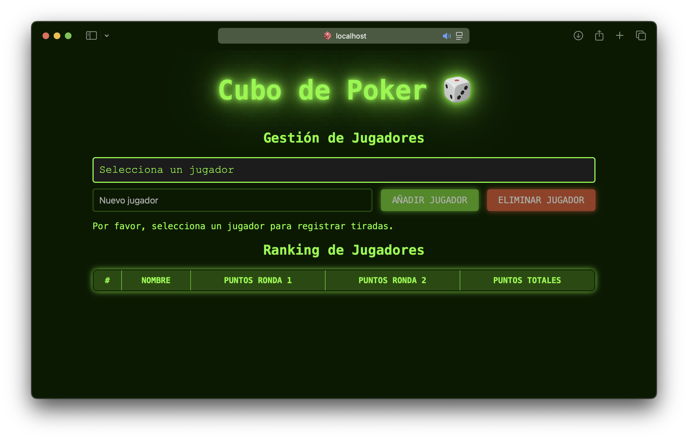
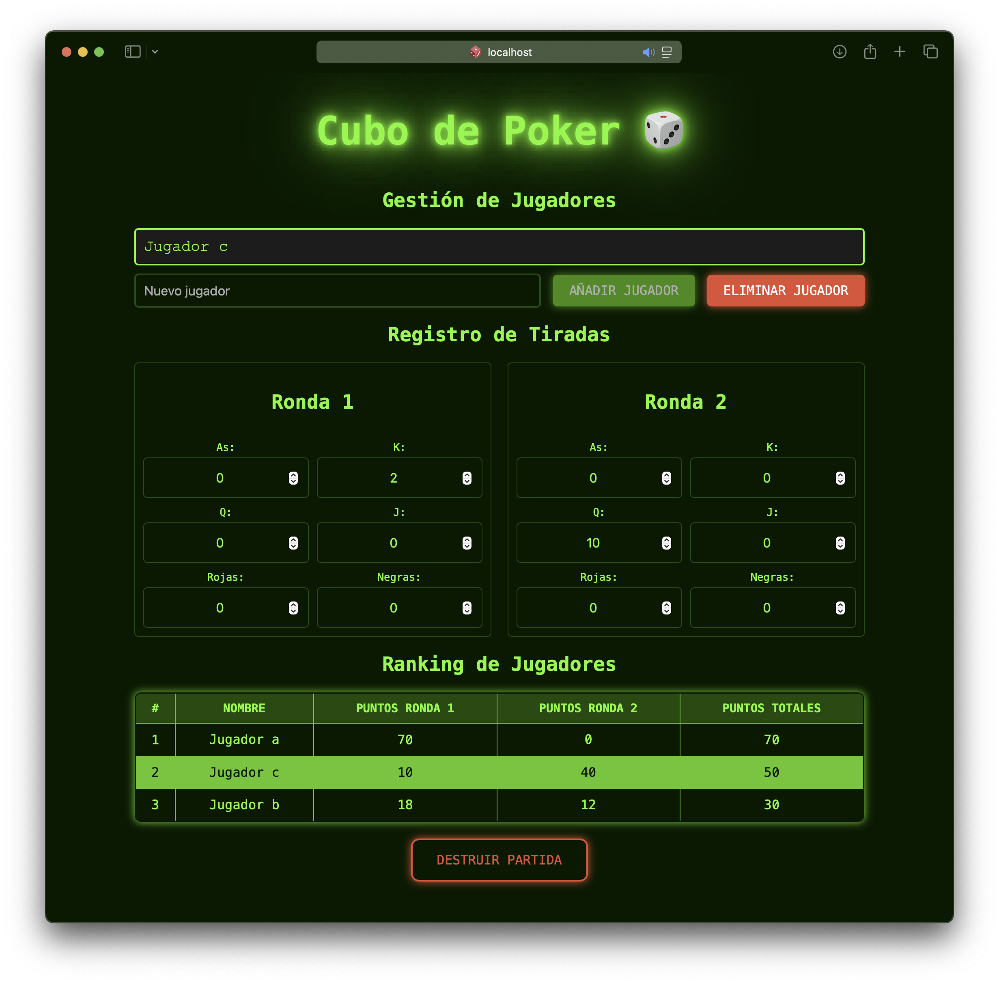

# Cubo de Poker 🎲

## Descripción
Cubo de Poker es una aplicación web desarrollada con React y TypeScript que permite gestionar partidas de poker con dados. La aplicación facilita el seguimiento de puntuaciones y rankings de los jugadores en tiempo real.

## Características Principales
- Gestión de jugadores (añadir/eliminar)
- Sistema de puntuación por tiradas
- Tabla de clasificación en tiempo real
- Almacenamiento local de partidas
- Interfaz intuitiva y responsive

## Screenshots

### Pantalla de carga

*Pantalla de carga mientras se carga la aplicación*

### Pantalla Principal

*Vista principal de la aplicación con la gestión de jugadores y puntuaciones*

### Pantalla de Juego

*Vista de la partida de poker con los dados y las tiradas*

## Requisitos Previos
- Node.js (versión recomendada: 18 o superior)
- npm (incluido con Node.js)

## Instalación
1. Clona el repositorio:
```bash
git clone https://github.com/JHORJE18/cubo-de-poker
```

2. Instala las dependencias:
```bash
npm install
```

## Scripts Disponibles
- `npm run dev`: Inicia el servidor de desarrollo
- `npm run build`: Genera la versión de producción
- `npm run preview`: Previsualiza la versión de producción
- `npm test`: Ejecuta los tests
- `npm run coverage`: Ejecuta los tests con cobertura

## Tecnologías Utilizadas
- React 18.3
- TypeScript
- Vite
- Vitest para testing
- Testing Library

## Estructura del Proyecto
```
src/
  ├── components/      # Componentes React
  ├── hooks/           # Hooks personalizados
  ├── __tests__/       # Tests
  ├── types.ts         # Definiciones de tipos
  └── App.tsx          # Componente principal
```

## Testing
El proyecto incluye tests unitarios y de integración utilizando Vitest y Testing Library. Los tests cubren:
- Gestión de jugadores
- Sistema de puntuación
- Renderizado de componentes
- Flujo completo de la aplicación

## PWA
La aplicación está configurada como Progressive Web App (PWA) con:
- Iconos para diferentes dispositivos
- Manifest para instalación
- Tema personalizado

## Licencia
Este proyecto está bajo la Licencia MIT.
